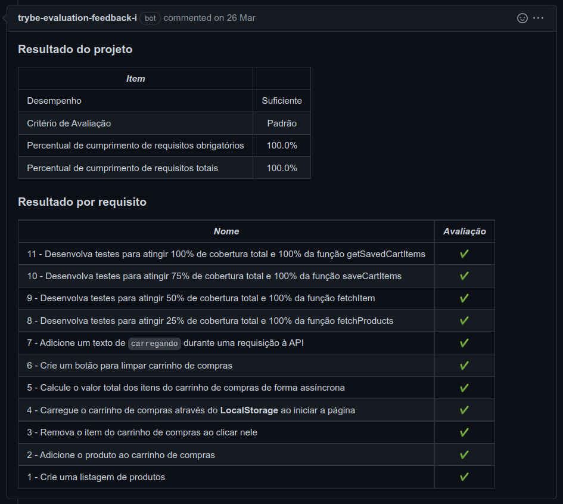
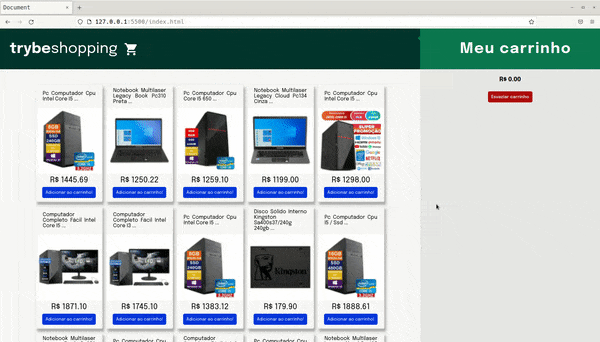

# Português 🇧🇷🇵🇹

<details>
  <summary>
    Saiba mais
  </summary>
  
  # TrybeWarts
Projeto da [Trybe](https://www.betrybe.com/) - Bloco 9 - Aplicação que simula um carrinho de compras com HTML, CSS e JavaScript.

## 💻 Projeto

<details>
  <summary><strong>🏆 Meu desempenho</strong></summary><br />

  
</details>
  
<details>
  <summary><strong>🖼️ Gif do projeto</strong></summary><br />

  <div>
    
  </div>
  <div>
    
  <div/>
</details>

## 🚀 Tecnologias
> Este projeto foi desenvolvido com:

- HTML
- CSS
- JavaScript ES6
- Jest

## 📌 Habilidades
> Habilidades desenvolvidas:

- Fazer requisições a uma API (Application Programming Interface) do Mercado Livre;
- Utilizar conhecimentos sobre JavaScript, CSS e HTML;
- Trabalhar com funções assíncronas;
- Implementar testes unitários.

## ⬇️ Instalando dependências

```bash
npm install
``` 

## 🧪 Executando os testes

```bash
npm test
npm run test:coverage
```
  
## Time de desenvolvimento
> Projeto individual:
  

## 💬 Contatos

<div align="center" style="display: inline_block">
  <a href="https://rabeloguedes.github.io" target="_blank">
    
  </a> 
  <a href="https://www.linkedin.com/in/al%C3%AA-emmanuel-rabelo-guedes/" target="_blank">
    
  </a> 
   <a href="mailto:rabeloguedes@proton.me">
     
  </a>
</div>

</details>

# English 🇺🇸🇬🇧

<details>
  <summary>
    More
  </summary>
  
  # TrybeWarts
Project from [Trybe](https://www.betrybe.com/) - Block 9 - Application, which simulates a shopping cart, build with HTML, CSS and JavaScript.

## 💻 Project

<details>
  <summary><strong>🏆 My accomplishment</strong></summary><br />

  
</details>
  
<details>
  <summary><strong>🖼️ Project's Gif</strong></summary><br />

   <div>
    
  </div>
  <div>
    
  <div/>
</details>

## 🚀 Technologies
> This project was developed with:

- HTML
- CSS
- JavaScript ES6
- Jest

## 📌 Skills
> Practiced skills:

- Request data through a Mercado Libre's API (Application Programming Interface);
- Use JavaScript, CSS and HTML knowledge.
- Work with asynchronous functions;
- Implement Unit Tests.
  
 ## ⬇️ Install dependencies

```bash
npm install
``` 

## 🧪 Execute tests

```bash
npm test
npm run test:coverage
```
  
## Squad
> Single Person Project:
  

## 💬 Contact

<div align="center" style="display: inline_block">
  <a href="https://rabeloguedes.github.io" target="_blank">
    
  </a> 
  <a href="https://www.linkedin.com/in/al%C3%AA-emmanuel-rabelo-guedes/" target="_blank">
    
  </a> 
   <a href="mailto:rabeloguedes@proton.me">
     
  </a>
</div>

</details>

# Deutsch 🇩🇪

<details>
  <summary>
    Mehr
  </summary>
  
  # TrybeWarts
Projekt von [Trybe](https://www.betrybe.com/) - Block 9 - Enkaufswagen Applikation mit HTML, CSS and JavaScript entwickelt.
  

## 💻 Projekt

<details>
  <summary><strong>🏆 Meine Leistung</strong></summary><br />
  
</details>
  
<details>
  <summary><strong>🖼️ Projekts Gif</strong></summary><br />

  <div>
    
  </div>
  <div>
    
  <div/>
</details>

## 🚀 Technologies
> Dieses Projekt wurde mit den entsprechenden Technologies hergestellt:

- HTML
- CSS
- JavaScript ES6
- Jest

## 📌 Fähigkeiten
> Ausgeübte Fähigkeiten:

- Mercado Libres API (Application Programming Interface) Asynchronous Anfoderung; 
- Benutzung von JavaScript, CSS und HTML Wissen. 
- Asynchronous Funktionenanwendung.
- Unit Tests deploy.

## ⬇️ Installieren dependencies

```bash
npm install
``` 

## 🧪 Tests Ausführung

```bash
npm test
npm run test:coverage
```
  
## Entwickungsteam
> Einer Person Projekt:
  

## 💬 Kontakt

<div align="center" style="display: inline_block">
  <a href="https://rabeloguedes.github.io" target="_blank">
    
  </a> 
  <a href="https://www.linkedin.com/in/al%C3%AA-emmanuel-rabelo-guedes/" target="_blank">
    
  </a> 
   <a href="mailto:rabeloguedes@proton.me">
     
  </a>
</div>

</details>
